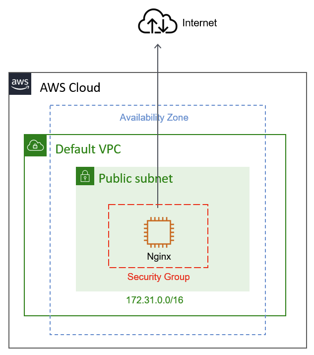

# Evolution #1 



## Step 1: Pre-requsite

### Install Terrafrom

https://learn.hashicorp.com/tutorials/terraform/install-cli?in=terraform/aws-get-started

### Create AWS Free Account

https://aws.amazon.com/premiumsupport/knowledge-center/create-and-activate-aws-account/


## Step 2: Build the infrastructure

### a. Create `main.tf` under root folder

### b. Add AWS provider module and provider congifuration

```terraform
# Configure the AWS Provider
terraform {
  required_providers {
    aws = {
      source  = "hashicorp/aws"
      version = "~> 3.0"
    }
  }
}

provider "aws" {
  region = "us-east-1"
  access_key = "<Replace with yours>"
  secret_key = "<Replace with yours>"
}
```
Reference: https://registry.terraform.io/providers/hashicorp/aws/latest/docs

### b. AWS Auth configuration

#### 1. How to get your access key ID and secret access key:
https://docs.aws.amazon.com/powershell/latest/userguide/pstools-appendix-sign-up.html

#### 2. Replace with your crediential

```terraform
provider "aws" {
  region = "us-east-1"
  access_key = "<Replace with yours>"
  secret_key = "<Replace with yours>"
}
```

### c. Add AWS services

#### 1. Add VPC module

```terraform
#This uses the default VPC.  It WILL NOT delete it on destroy.
resource "aws_default_vpc" "default" {

}
```

#### 2. Add security group 

```terraform
# To allow http request to EC2 instance
resource "aws_security_group" "nginx-sg" {
  name        = "nginx_demo"
  description = "Allow ports for nginx demo"
  vpc_id      = aws_default_vpc.default.id

  ingress {
    from_port   = 80
    to_port     = 80
    protocol    = "tcp"
    cidr_blocks = ["0.0.0.0/0"]
  }
  egress {
    from_port   = 0
    to_port     = 0
    protocol    = -1
    cidr_blocks = ["0.0.0.0/0"]
  }
}
```

#### 3. Add a EC2 instance

```terraform
resource "aws_instance" "nginx" {
  ami                    = "ami-06eecef118bbf9259"
  instance_type          = "t2.micro"
  vpc_security_group_ids = [aws_security_group.nginx-sg.id]
  tags = {
    Name = "web-server"
  }
  user_data = <<-EOF
               #! bin/bash
               sudo amazon-linux-extras install epel -y
               sudo yum update
               sudo yum install nginx -y
               sudo service nginx start
               EOF
}
```

### d. Create `output.tf` under root folder

```terraform
# Print out the DNS url for EC2 when the provisioning is done
output "aws_instance_public_dns" {
  value = aws_instance.nginx.public_dns
}
```

### e. Provision the resources via Terraform

#### 1. `terraform init` - Initialize the directory

#### 2. `terraform apply` - Create Infrastructure

## Step 3: Validate infrastructure

Go to AWS management console to validate what you have provisioned, or you can access the DNS from the terraform output as well.

## Step 4: Destroy infrastructure

### a. `terraform destory`