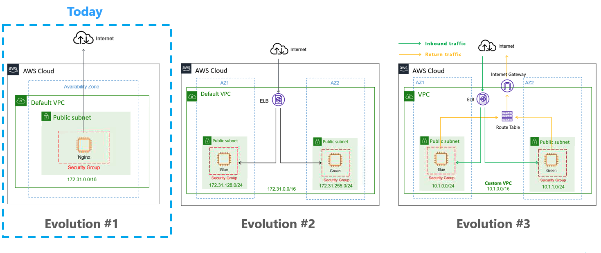

# Evolution #1 



## Step 1: Pre-requsite

### Install Terrafrom

https://learn.hashicorp.com/tutorials/terraform/install-cli?in=terraform/aws-get-started

### Create AWS Free Account

https://aws.amazon.com/premiumsupport/knowledge-center/create-and-activate-aws-account/


## Step 2: Build the infrastructure

### a. Create `main.tf` under root folder

### b. Add AWS provider module and provider congifuration

```terraform
# Configure the AWS Provider
terraform {
  required_providers {
    aws = {
      source  = "hashicorp/aws"
      version = "~> 3.0"
    }
  }
}

provider "aws" {
  region = "us-east-1"
  access_key = var.aws_access_key
  secret_key = var.aws_secret_key
}
```
Reference: https://registry.terraform.io/providers/hashicorp/aws/latest/docs

### b. Define the variables

#### 2. Add Variable in `main.tf`

```terraform
# VARIABLES
variable "aws_access_key" {}
variable "aws_secret_key" {}
```

#### 3. Create `terraform.tfvars` under root folder

```terraform
aws_access_key = "<Replace with yours>"
aws_secret_key = "<Replace with yours>"
```

How to get your access key ID and secret access key:
https://docs.aws.amazon.com/powershell/latest/userguide/pstools-appendix-sign-up.html
