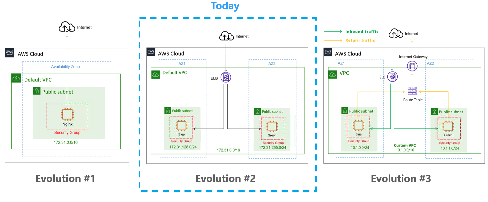

# Evolution #2 



## Step 1: Provision Day 1 Architecture (if you deleted)

`terraform apply --auto-approve`

## Step 2: Replace hardcoded values with <ins>Variable</ins>

### a. Create `variable.tf` and declare Variables

```terraform
variable "aws_access_key" {}
variable "aws_secret_key" {}
```

### b. Create `terraform.tfvars` under root folder

```terraform
aws_access_key = "<Replace with yours>"
aws_secret_key = "<Replace with yours>"
```

### c. Reference the Variable in `aws` Provider

```terraform
provider "aws" {
  region = "us-east-1"
  access_key = var.aws_access_key
  secret_key = var.aws_secret_key
}
```

## Step 3: Fetch AMI ID using <ins>Data Source</ins>

### a. Add `aws_ami` Data block

```terraform
data "aws_ami" "aws_linux" {
  most_recent      = true
  owners           = ["amazon"]

  filter {
    name   = "name"
    values = ["amzn2-ami-kernel*"]
  }

  filter {
    name   = "root-device-type"
    values = ["ebs"]
  }

  filter {
    name   = "virtualization-type"
    values = ["hvm"]
  }
}
```

For more details, please visit https://registry.terraform.io/providers/hashicorp/aws/latest/docs/data-sources/ami

### b. Reference Data source in EC2 block

```terraform
resource "aws_instance" "blue" {
  ami                    = data.aws_ami.aws_linux.id
  ......
}
```

## Step 4: Migrate to HA architecture using <ins>Resource</ins>

### a. Add subnet * 2

```terraform
resource "aws_subnet" "subnet1" {
  vpc_id     = aws_default_vpc.default.id
  cidr_block = "172.31.128.0/24" 
  availability_zone       = "us-east-1a"
  map_public_ip_on_launch = true
}

resource "aws_subnet" "subnet2" {
  vpc_id     = aws_default_vpc.default.id
  cidr_block = "172.31.255.0/24" 
  availability_zone       = "us-east-1b"
  map_public_ip_on_launch = true
}
```

### b. Add EC2 instacne * 2

```terraform
resource "aws_instance" "blue" {
  ami                    = data.aws_ami.aws_linux.id
  instance_type          = "t2.micro"
  vpc_security_group_ids = [aws_security_group.nginx-sg.id]
  subnet_id = aws_subnet.subnet1.id
  tags = {
    Name = "Blue team"
  }
  user_data = <<-EOF
               #! bin/bash
               sudo amazon-linux-extras install epel -y
               sudo yum update
               sudo yum install nginx -y
               sudo service nginx start
               sudo rm /usr/share/nginx/html/index.html
               echo '<html><head><title>Blue Team Server</title></head><body style="background-color:#1F778D"><p style="text-align: center;"><span style="color:#FFFFFF;"><span style="font-size:28px;">Blue Team</span></span></p></body></html>' | sudo tee /usr/share/nginx/html/index.html
               EOF
}

resource "aws_instance" "green" {
  ami                    = data.aws_ami.aws_linux.id
  instance_type          = "t2.micro"
  vpc_security_group_ids = [aws_security_group.nginx-sg.id]
  subnet_id = aws_subnet.subnet2.id
  tags = {
    Name = "Green team"
  }
  user_data = <<-EOF
               #! bin/bash
               sudo amazon-linux-extras install epel -y
               sudo yum update
               sudo yum install nginx -y
               sudo service nginx start
               sudo rm /usr/share/nginx/html/index.html
               echo '<html><head><title>Green Team Server</title></head><body style="background-color:#77A032"><p style="text-align: center;"><span style="color:#FFFFFF;"><span style="font-size:28px;">Green Team</span></span></p></body></html>' | sudo tee /usr/share/nginx/html/index.html
               EOF
}
```

### c. Add ELB

```terraform
#ELB
# Create a new load balancer
resource "aws_elb" "web" {
  name               = "nginx-elb"

  subnets = [aws_subnet.subnet1.id, aws_subnet.subnet2.id]
  security_groups = [aws_security_group.nginx-sg.id]
  instances = [aws_instance.blue.id, aws_instance.green.id]

  listener {
    instance_port     = 80
    instance_protocol = "http"
    lb_port           = 80
    lb_protocol       = "http"
  }
}
```

### f. Modify the `output.tf`

Replace the content with the codes below

```terraform
output "aws_instance_public_dns" {
  value = aws_elb.web.dns_name
}
```

### e. Remove the old EC2

```terraform
resource "aws_instance" "nginx" {
  ami                    = "ami-06eecef118bbf9259"
  instance_type          = "t2.micro"
  ......
}
```

## Step 5: Provision the infrastructure

### a. `terraform plan`
### b. `terraform apply`

## Step 6: Validate infrastructure

You can access the DNS Url from the terraform output.