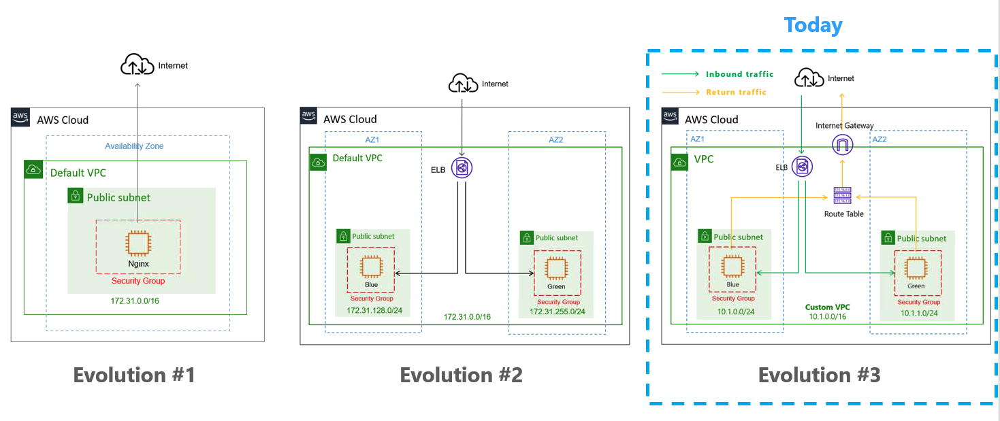

# Evolution #3 



## Step 1: Provision Day 2 Architecture (if you deleted)

`terraform apply --auto-approve`

## Step 2: Create custom VPC

### Option 1: Use Terraform Resources - without Terraform Module

We need to add `vpc*1 + subnet*2 + igw*1 + rt*1 + rta*2` = 7 resource blocks

```terraform
# NETWORKING #
resource "aws_vpc" "vpc" {
  cidr_block           = "10.1.0.0/16"
  enable_dns_hostnames = "true"
}

resource "aws_subnet" "subnet1" {
  cidr_block              = "10.1.0.0/24"
  vpc_id                  = aws_vpc.vpc.id
  map_public_ip_on_launch = "true"
  availability_zone       = "us-east-1a"
}

resource "aws_subnet" "subnet2" {
  cidr_block              = "10.1.1.0/24"
  vpc_id                  = aws_vpc.vpc.id
  map_public_ip_on_launch = "true"
  availability_zone       = "us-east-1b"
}


resource "aws_internet_gateway" "igw" {
  vpc_id = aws_vpc.vpc.id
}

# ROUTING #
resource "aws_route_table" "rtb" {
  vpc_id = aws_vpc.vpc.id

  route {
    cidr_block = "0.0.0.0/0"
    gateway_id = aws_internet_gateway.igw.id
  }
}

resource "aws_route_table_association" "rta-subnet1" {
  subnet_id      = aws_subnet.subnet1.id
  route_table_id = aws_route_table.rtb.id
}
resource "aws_route_table_association" "rta-subnet2" {
  subnet_id      = aws_subnet.subnet2.id
  route_table_id = aws_route_table.rtb.id
}
```

### Option 2: Use Terraform VPC <ins>Module</ins> (recommended)

Only need one VPC module

```terraform

module "vpc" {
  source = "terraform-aws-modules/vpc/aws"

  name = "my-vpc"
  cidr = "10.1.0.0/16"

  azs             = ["us-east-1a", "us-east-1b"]
  private_subnets = []
  public_subnets  = ["10.1.0.0/24", "10.1.1.0/24"]

}
```

Please refer to [Terraform Module](https://registry.terraform.io/modules/terraform-aws-modules/vpc/aws/latest) for more details

## Step 3: Create our own <ins>Modules</ins> - Package all the things 

### a: Module strcutrue

- `variables.tf` - Variable (input)
- `outputs.tf` - Output values
- `main.tf` - Infrastructure objects

#### 1: Create Module folder and files

```bash
mkdir webapp_module

cd webapp_module
touch variables.tf
touch outputs.tf
touch main.tf
```

#### 2: Declare variables

Edit `webapp_module/variables.tf`

```terraform
variable "web_name" {
  type = string
}
```

#### 3: Define Infrastructure 

Edit `webapp_module/main.tf`, move the following blocks from `main.tf` under root folder to Module folder

```terraform
# DATA #
data "aws_ami" "aws-linux" {
  most_recent = true
  owners      = ["amazon"]

  filter {
    name   = "name"
    values = ["amzn2-ami-kernel*"]
  }

  filter {
    name   = "root-device-type"
    values = ["ebs"]
  }

  filter {
    name   = "virtualization-type"
    values = ["hvm"]
  }
}


# NETWORKING #
module "vpc" {
  source = "terraform-aws-modules/vpc/aws"

  name = "my-vpc"
  cidr = "10.1.0.0/16"

  azs             = ["us-east-1a", "us-east-1b"]
  private_subnets = []
  public_subnets  = ["10.1.0.0/24", "10.1.1.0/24"]

}

# SECURITY GROUPS #
resource "aws_security_group" "nginx-sg" {
  name        = "nginx_demo"
  description = "Allow ports for nginx demo"
  vpc_id      = module.vpc.vpc_id

  ingress {
    from_port   = 80
    to_port     = 80
    protocol    = "tcp"
    cidr_blocks = ["0.0.0.0/0"]
  }
  egress {
    from_port   = 0
    to_port     = 0
    protocol    = -1
    cidr_blocks = ["0.0.0.0/0"]
  }
}

# LOAD BALANCER #
resource "aws_elb" "web" {
  name = var.web_name

  subnets         = module.vpc.public_subnets
  security_groups = [aws_security_group.nginx-sg.id]
  instances       = [aws_instance.blue.id, aws_instance.green.id]

  listener {
    instance_port     = 80
    instance_protocol = "http"
    lb_port           = 80
    lb_protocol       = "http"
  }
}

# EC2 INSTANCES #
resource "aws_instance" "blue" {
  ami                    = data.aws_ami.aws-linux.id
  instance_type          = "t2.micro"
  vpc_security_group_ids = [aws_security_group.nginx-sg.id]
  subnet_id              = module.vpc.public_subnets[0]
  tags = {
    Name = "Blue Team"
  }
  user_data = <<-EOF
               #! bin/bash
               sudo amazon-linux-extras install epel -y
               sudo yum update
               sudo yum install nginx -y
               sudo service nginx start
               sudo rm /usr/share/nginx/html/index.html
               echo '<html><head><title>Blue Team Server</title></head><body style="background-color:#1F778D"><p style="text-align: center;"><span style="color:#FFFFFF;"><span style="font-size:28px;">Blue Team</span></span></p></body></html>' | sudo tee /usr/share/nginx/html/index.html
               EOF
}

resource "aws_instance" "green" {
  ami                    = data.aws_ami.aws-linux.id
  instance_type          = "t2.micro"
  vpc_security_group_ids = [aws_security_group.nginx-sg.id]
  subnet_id              = module.vpc.public_subnets[1]
  tags = {
    Name = "Green Team"
  }
  user_data = <<-EOF
               #! bin/bash
               sudo amazon-linux-extras install epel -y
               sudo yum update
               sudo yum install nginx -y
               sudo service nginx start
               sudo rm /usr/share/nginx/html/index.html
               echo '<html><head><title>Green Team Server</title></head><body style="background-color:#77A032"><p style="text-align: center;"><span style="color:#FFFFFF;"><span style="font-size:28px;">Green Team</span></span></p></body></html>' | sudo tee /usr/share/nginx/html/index.html
               EOF
}
```


#### 4: Define output

Edit `webapp_module/outputs.tf`

```terraform
# OUTPUT
output "aws_elb_dns" {
  value = aws_elb.web.dns_name
}
```


## Step 4: Reference our own Module

### a: Edit `main.tf` under root folder

```terraform
module "webapp_module" {
  source   = "./webapp_module"
  web_name = "tim-web" // give it a name
}
```

Now the `main.tf` should look like this

```terraform
# Configure the AWS Provider
terraform {
  required_providers {
    aws = {
      source  = "hashicorp/aws"
      version = "~> 3.0"
    }
  }
}

provider "aws" {
  region     = "us-east-1"
  access_key = var.aws_access_key
  secret_key = var.aws_secret_key
}

module "webapp_module" {
  source   = "./webapp_module"
  web_name = "tim-web"
}
```

### b: Update `outputs.tf` under root folder

```terraform
# OUTPUT
output "aws_elb_dns" {
  value = module.webapp_module.aws_elb_dns
}
```

## Step 5: Provision the infrastructure

### a. `terraform plan`
### b. `terraform apply`

## Step 6: Validate infrastructure

You can access the DNS Url from the terraform output.