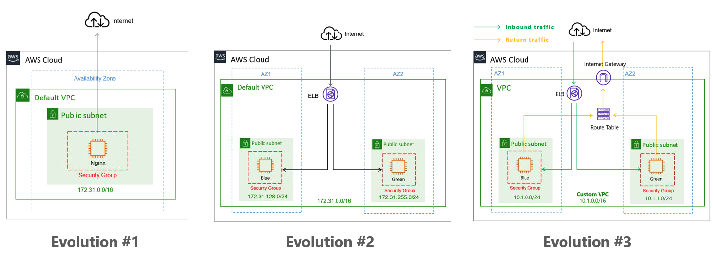

# terraform-demo

## Architecture Evolution

- Evolution #1 - Nginx server hosted on a Standalone EC2 instance

- Evolution #2 - Two Nignx servers provisioned across different AZ, with ELB to balance the traffic

- Evolution #3 - Package all the resources in a module

